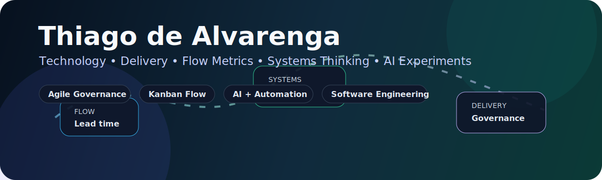
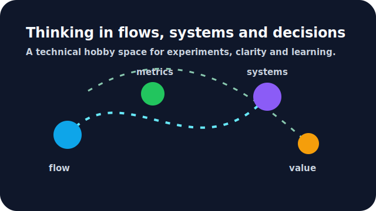

  

<h1 align="center">Olá, eu sou Thiago de Alvarenga 👋</h1>

  

  
  
  

  
  
  
  

---

## 📊 GitHub em movimento

  

  

---

## 🧭 Sobre mim

Sou um profissional de tecnologia que começou colocando a mão em suporte, redes, infraestrutura e sistemas — e encontrou na gestão, no delivery e na governança uma forma de conectar **pessoas, processos, indicadores e tecnologia**.

Hoje atuo mais perto do **fluxo, da previsibilidade, dos indicadores e das decisões** do que do código em si. Mas tecnologia continua sendo parte central da minha forma de pensar.

Uso este GitHub como um espaço pessoal de estudo, curiosidade e experimentação técnica. Aqui posso testar ideias, organizar raciocínios, brincar com automações, estudar inteligência artificial, revisar arquitetura e manter meu lado técnico vivo.

Não estou tentando parecer desenvolvedor full-time. Estou deixando claro que gestão em tecnologia fica muito melhor quando ainda existe **repertório técnico, curiosidade e capacidade real de conversar com quem constrói**.

---

## ⚙️ Como penso tecnologia

  

Tecnologia, para mim, não é apenas código.

É uma forma de **estruturar problemas**, reduzir ambiguidade, criar rastreabilidade e sustentar decisões melhores.

Gosto de observar sistemas pelo comportamento do fluxo:

- onde o trabalho para;
- onde a decisão atrasa;
- onde a dependência se acumula;
- onde o retrabalho aparece;
- onde a métrica mostra algo que a reunião ainda não conseguiu explicar.

Esse olhar técnico me ajuda a atuar melhor em **gestão, delivery, governança, melhoria contínua e transformação operacional**.

---

## 🧪 O que gosto de explorar por aqui

- **Engenharia de software** como base de raciocínio técnico
- **Arquitetura e modelagem** como formas de reduzir complexidade
- **Automação e scripts** para remover atrito do trabalho real
- **IA aplicada** à produtividade, análise, carreira e tomada de decisão
- **Métricas de fluxo** como lead time, throughput, WIP e retrabalho
- **Documentação técnica** como ferramenta de alinhamento e memória
- **Sistemas sociotécnicos**, onde tecnologia, pessoas e processos se afetam o tempo todo

---

## 🧰 Repertório e ferramentas

  
  
  
  
  
  
  
  
  
  
  

---

## 🤝 Vamos conversar?

  
  
  

  <em>Gestão em tecnologia fica melhor quando quem lidera ainda entende o fluxo, o sistema e o trabalho real.</em>

<!--
Observação:
Evitei seção de "projetos em destaque" para não posicionar este perfil como vitrine de desenvolvedor.
A intenção aqui é demonstrar repertório técnico, curiosidade, raciocínio sistêmico e conexão real com tecnologia.
-->
